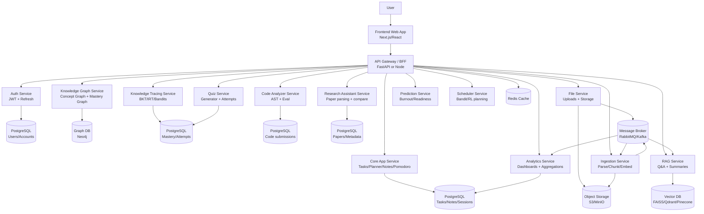
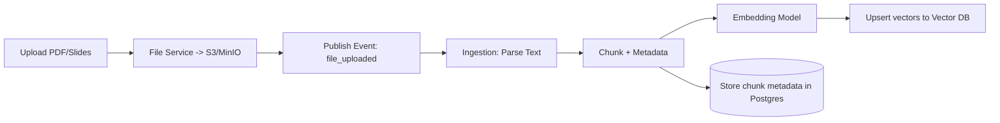
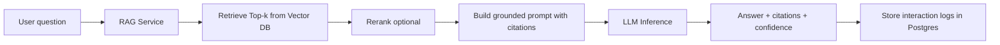
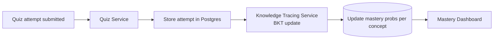
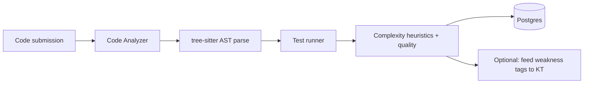
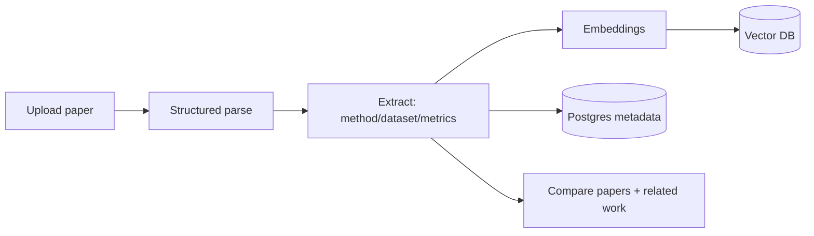
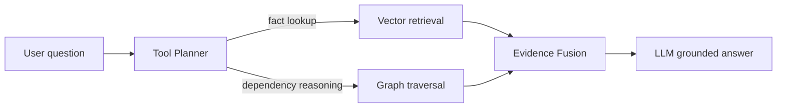

## 🏗️ System Architecture
Here is the high-level microservices and data flow architecture Diagram (All Phases) for NeuroLearn:

### How to read this:
- The API Gateway/BFF is the only thing the frontend talks to.
- Every major capability is a service behind it (even if Phase 1 you run them inside one codebase).

---

## 🏗️ Phase-by-Phase: "What Exists When"

### 📍 Phase 1 (MVP Productivity)
**Strategy:** Run as one Core API + Postgres (and optional Redis).
* **Services active:** API Gateway, Auth, Core App, Basic Analytics.
* **Databases:** PostgreSQL (required), Redis (optional), Object storage (optional).
* ✅ **Deployment:** Deployable with **Docker Compose**.

### 🤖 Phase 2 (Vector RAG Study Assistant)
**Strategy:** Add AI ingestion + RAG.
* **Services added:** File Service, Ingestion Service, RAG Service, Vector DB.
* **Databases added:** Object storage (S3/MinIO), Vector DB (Qdrant/FAISS).

### 📈 Phase 3 (Adaptive Learning Engine)
**Strategy:** Add quiz attempts + mastery.
* **Services added:** Quiz Service, Knowledge Tracing Service (BKT), Mastery Dashboard.
* **Databases added:** Postgres tables for attempts/mastery + event logs.

### 🔬 Phase 4 (Research + Code Intelligence)
**Strategy:** Add research paper parsing and code analysis.
* **Services added:** Research Assistant Service, Code Analyzer Service.

### 🌌 Phase 5 (Advanced Intelligence)
**Strategy:** Add graph + prediction + RL.
* **Services added:** Knowledge Graph Service (Neo4j), Hybrid GraphRAG (RAG + KG), Prediction Service (burnout/readiness), Scheduler Service (bandit → RL), Explainability in Analytics

---

## 🗄️ Core Data Stores (What goes where)

### 🐘 PostgreSQL (Source of truth)
* **Phase 1-2:** Users, subjects/courses, tasks, notes, sessions, pomodoro logs.
* **Phase 3-4:** Quiz attempts, mastery probabilities, paper metadata, code submission metadata.

### 📦 Object Storage (S3/MinIO)
* **Content:** PDFs, slides, research papers, images, note attachments.

### 🔍 Vector DB (FAISS/Qdrant/Pinecone)
* **Embeddings:** Document chunk embeddings (study assistant).
* **Future:** Note embeddings (later), Paper embeddings (research assistant).

### 🕸️ Neo4j (Phase 5)
* **Graphs:** Concept dependency graph, paper citation/method graph.
* **Personalization:** Mastery graph (user → concept → mastery_prob).

### ⚡ Redis
* **Operations:** Sessions, rate limiting, caching RAG results, caching mastery summaries.

### 📩 Message Broker (RabbitMQ/Kafka)
* **Async Pipelines:** * Upload triggers ingestion
    * Ingestion triggers embedding
    * Embedding triggers indexing
* **Background Jobs:** Analytics aggregation jobs.

---

## 🤖 AI Pipelines (Exact Data Flow)
### 1) RAG Ingestion Pipeline (Phase 2)

### Key design rule:
Vectors go to Vector DB; chunk metadata + permissions stay in Postgres.

---

### 2) RAG Query Pipeline (Phase 2)

---

### 3) Knowledge Tracing Pipeline (Phase 3)

---

### 4) Code Analyzer Pipeline (Phase 4)

---

### 5) Research Paper Pipeline (Phase 4)

---

### 5) Hybrid GraphRAG (Phase 5)

---

## What to Build First

1. DB schema + migrations (subjects, tasks, sessions, notes, pomodoro_logs)
2. Auth + JWT
3. Core endpoints (CRUD)
4. Frontend screens
5. Basic analytics aggregates
6. File upload + storage (bridge to Phase 2)
7. Ingestion worker + vector DB (Phase 2 begins)
