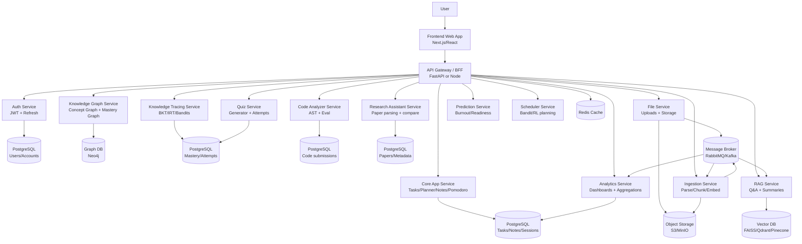

## 🏗️ System Architecture

Here is the high-level microservices and data flow architecture Diagram (All Phases) for NeuroLearn:

```mermaid
flowchart TB
    U[User] --> FE[Frontend Web App\nNext.js/React]
    FE --> GW[API Gateway / BFF\nFastAPI or Node]

    GW --> AUTH[Auth Service\nJWT + Refresh]
    GW --> CORE[Core App Service\nTasks/Planner/Notes/Pomodoro]
    GW --> FILE[File Service\nUploads + Storage]
    GW --> ANA[Analytics Service\nDashboards + Aggregations]

    %% AI Services
    GW --> RAG[RAG Service\nQ&A + Summaries]
    GW --> ING[Ingestion Service\nParse/Chunk/Embed]
    GW --> KT[Knowledge Tracing Service\nBKT/IRT/Bandits]
    GW --> QUIZ[Quiz Service\nGenerator + Attempts]
    GW --> CODE[Code Analyzer Service\nAST + Eval]
    GW --> RES[Research Assistant Service\nPaper parsing + compare]
    GW --> KG[Knowledge Graph Service\nConcept Graph + Mastery Graph]
    GW --> PRED[Prediction Service\nBurnout/Readiness]
    GW --> SCHED[Scheduler Service\nBandit/RL planning]

    %% Datastores
    AUTH --> PG[(PostgreSQL\nUsers/Accounts)]
    CORE --> PG2[(PostgreSQL\nTasks/Notes/Sessions)]
    ANA --> PG2
    FILE --> OBJ[(Object Storage\nS3/MinIO)]
    ING --> OBJ
    RAG --> VDB[(Vector DB\nFAISS/Qdrant/Pinecone)]
    KG --> GDB[(Graph DB\nNeo4j)]
    KT --> PG3[(PostgreSQL\nMastery/Attempts)]
    QUIZ --> PG3
    CODE --> PG4[(PostgreSQL\nCode submissions)]
    RES --> PG5[(PostgreSQL\nPapers/Metadata)]

    %% Infra
    GW --> REDIS[(Redis Cache)]
    ING --> MQ[(Message Broker\nRabbitMQ/Kafka)]
    FILE --> MQ
    MQ --> ING
    MQ --> RAG
    MQ --> ANA
```
