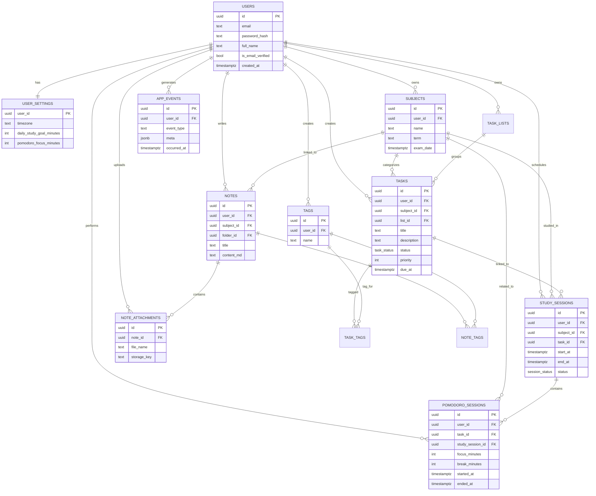

```mermaid
erDiagram

    USERS ||--|| USER_SETTINGS : has
    USERS ||--o{ SUBJECTS : owns
    USERS ||--o{ TASK_LISTS : owns
    USERS ||--o{ TASKS : creates
    USERS ||--o{ STUDY_SESSIONS : schedules
    USERS ||--o{ POMODORO_SESSIONS : performs
    USERS ||--o{ NOTES : writes
    USERS ||--o{ TAGS : creates
    USERS ||--o{ NOTE_ATTACHMENTS : uploads
    USERS ||--o{ APP_EVENTS : generates

    SUBJECTS ||--o{ TASKS : categorizes
    SUBJECTS ||--o{ STUDY_SESSIONS : studied_in
    SUBJECTS ||--o{ POMODORO_SESSIONS : related_to
    SUBJECTS ||--o{ NOTES : linked_to

    TASK_LISTS ||--o{ TASKS : groups

    TASKS ||--o{ TASK_TAGS : tagged
    TAGS ||--o{ TASK_TAGS : tag_for

    NOTES ||--o{ NOTE_TAGS : tagged
    TAGS ||--o{ NOTE_TAGS : tag_for

    NOTES ||--o{ NOTE_ATTACHMENTS : contains

    TASKS ||--o{ STUDY_SESSIONS : linked_to
    STUDY_SESSIONS ||--o{ POMODORO_SESSIONS : contains

    USERS {
        uuid id PK
        text email
        text password_hash
        text full_name
        bool is_email_verified
        timestamptz created_at
    }

    USER_SETTINGS {
        uuid user_id PK
        text timezone
        int daily_study_goal_minutes
        int pomodoro_focus_minutes
    }

    SUBJECTS {
        uuid id PK
        uuid user_id FK
        text name
        text term
        timestamptz exam_date
    }

    TASKS {
        uuid id PK
        uuid user_id FK
        uuid subject_id FK
        uuid list_id FK
        text title
        text description
        task_status status
        int priority
        timestamptz due_at
    }

    STUDY_SESSIONS {
        uuid id PK
        uuid user_id FK
        uuid subject_id FK
        uuid task_id FK
        timestamptz start_at
        timestamptz end_at
        session_status status
    }

    POMODORO_SESSIONS {
        uuid id PK
        uuid user_id FK
        uuid task_id FK
        uuid study_session_id FK
        int focus_minutes
        int break_minutes
        timestamptz started_at
        timestamptz ended_at
    }

    NOTES {
        uuid id PK
        uuid user_id FK
        uuid subject_id FK
        uuid folder_id FK
        text title
        text content_md
    }

    TAGS {
        uuid id PK
        uuid user_id FK
        text name
    }

    NOTE_ATTACHMENTS {
        uuid id PK
        uuid note_id FK
        text file_name
        text storage_key
    }

    APP_EVENTS {
        uuid id PK
        uuid user_id FK
        text event_type
        jsonb meta
        timestamptz occurred_at
    }
```