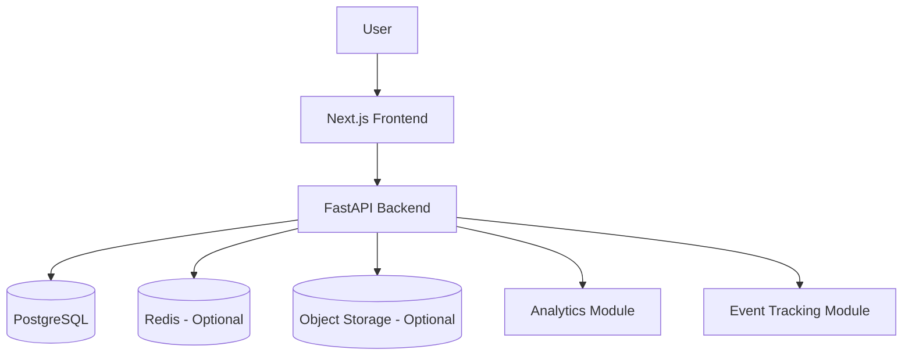
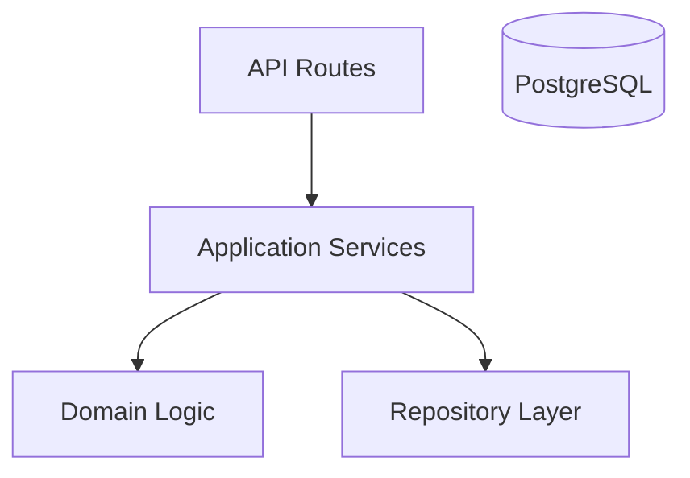
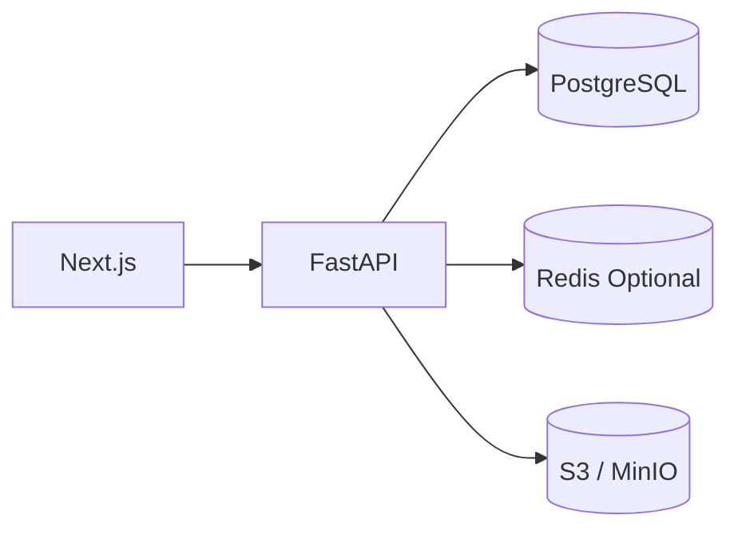
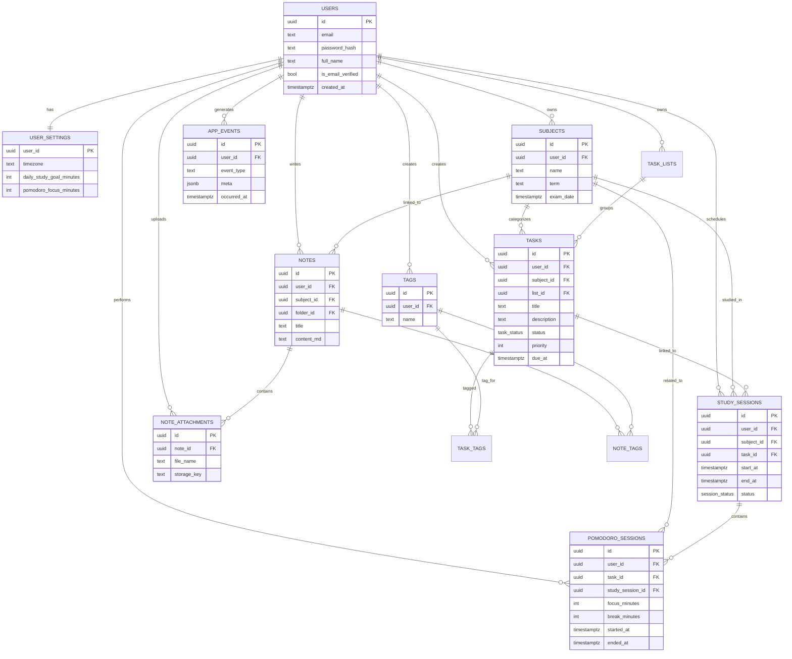

# 🧠 NeuroLearn — Phase 1 System Architecture

## 📖 Overview

NeuroLearn Phase 1 is built as a **modular monolith** designed to support future expansion into AI-driven services.

The system is composed of:
* **Frontend:** Next.js + React + Tailwind
* **Backend:** FastAPI
* **Database:** PostgreSQL
* **Optional:** Redis
* **Optional:** Object Storage (S3 / MinIO)

Phase 1 focuses on:
* study productivity
* structured learning data collection
* behavioral event logging

The architecture is intentionally designed to allow future integration of:
* RAG systems
* adaptive learning models
* knowledge tracing
* reinforcement learning scheduling
* GraphRAG knowledge graphs
* document intelligence pipelines

---

## High-Level Architecture



---

# 🏛️ Architecture Principles

## 1. Modular Monolith 📦
Phase 1 is implemented as a single backend application with internal module boundaries.
Advantages:
* simpler deployment
* easier development
* easier debugging
* easier iteration
* supports later service extraction

Modules remain logically isolated to allow future conversion into microservices.

## 2. Backend as System Authority ⚖️
The backend is responsible for:
* authentication
* business logic
* validation
* permissions
* data integrity
* analytics aggregation
* event logging

The frontend must never implement business rules that affect system correctness.

## 3. PostgreSQL as Source of Truth 🐘
PostgreSQL stores all structured data.
Primary stored entities:
* users
* user settings
* subjects
* tasks
* study sessions
* pomodoro sessions
* notes
* tags
* note attachments metadata
* application events

## 4. Event-Driven Learning Intelligence 🧠
Event tracking is a core architectural feature.
All major user actions must be logged.
These logs support future systems such as:
* burnout prediction
* adaptive scheduling
* productivity scoring
* mastery estimation
* explainability pipelines

---

# ⚙️ Core System Modules

## 1. Auth Module 🔐
Responsibilities:
* user registration
* login
* password hashing
* JWT authentication
* token validation

Owned entities:
* authentication credentials
* login sessions
* token management

## 2. User Module 👤
Responsibilities:
* user profile
* study preferences
* timezone
* daily goals
* pomodoro defaults

Owned entities:
* user profile
* user settings

## 3. Subject Module 📚
Responsibilities:
* create subjects
* edit subjects
* archive subjects
* subject metadata

Subjects act as top-level containers for academic organization.
Connected entities:
* tasks
* study sessions
* notes
* analytics

## 4. Task Module ✅
Responsibilities:
* create tasks
* edit tasks
* complete tasks
* set priority
* assign due dates
* associate tasks with subjects

Tasks represent planned study work.

## 5. Study Session Module ⏱️
Responsibilities:
* schedule study sessions
* start sessions
* complete sessions
* cancel sessions
* link sessions to tasks and subjects

Study sessions capture actual learning activity.

## 6. Pomodoro Module 🍅
Responsibilities:
* focus cycles
* break cycles
* interruption logging
* pomodoro session tracking

Pomodoro data is used for:
* productivity analytics
* focus quality analysis
* future scheduling intelligence

## 7. Notes Module 📝
Responsibilities:
* create notes
* edit notes
* delete notes
* markdown storage
* tagging
* subject linking

Notes support:
* structured learning
* knowledge capture
* later semantic search
* future RAG integration

## 8. Attachments Module 📎
Responsibilities:
* manage file metadata
* associate files with notes
* validate file types
* store object storage keys

Actual file binaries are stored in object storage.

## 9. Analytics Module 📊
Responsibilities:
* dashboard metrics
* study time statistics
* subject distribution
* task completion metrics
* focus session statistics

Analytics provides immediate productivity insights.

## 10. Event Tracking Module 📡
Responsibilities:
* store user behavior events
* validate event metadata
* maintain activity history

Example events:
* subject_created
* task_created
* task_completed
* session_started
* session_completed
* pomodoro_started
* pomodoro_completed
* note_created
* attachment_uploaded.
    REPOSITORY --> DATABASE

---

## Backend Layer Architecture


---

# 🏗️ Layer Responsibilities

## API Routes 🌐
Responsibilities:
* HTTP request handling
* authentication dependency injection
* response formatting

Routes should contain no business logic.

## Application Services ⚙️
Responsibilities:
* system use cases
* orchestration of domain logic
* coordination of repositories

Examples:
* create_subject
* complete_task
* start_study_session
* generate_dashboard_metrics

## Domain Logic 🧠
Responsibilities:
* system rules
* entity validation
* domain constraints

Examples:
* tasks must belong to the current user
* sessions must belong to subjects
* completed tasks cannot be active

## Repository Layer 🗄️
Responsibilities:
* database queries
* entity persistence
* data retrieval

Repositories isolate the application from direct database access.

---

## Backend Project Structure
```
backend/
│
├── app/
│   ├── main.py
│
│   ├── core/
│   │   ├── config/
│   │   ├── security/
│   │   ├── database/
│   │   ├── logging/
│   │   ├── exceptions/
│   │   └── utils/
│
│   ├── api/
│   │   ├── deps/
│   │   └── routes/
│   │       ├── auth.py
│   │       ├── users.py
│   │       ├── subjects.py
│   │       ├── tasks.py
│   │       ├── study_sessions.py
│   │       ├── pomodoro.py
│   │       ├── notes.py
│   │       ├── attachments.py
│   │       ├── analytics.py
│   │       └── events.py
│
│   ├── modules/
│   │   ├── auth/
│   │   ├── users/
│   │   ├── subjects/
│   │   ├── tasks/
│   │   ├── study_sessions/
│   │   ├── pomodoro/
│   │   ├── notes/
│   │   ├── attachments/
│   │   ├── analytics/
│   │   └── events/
│
│   ├── shared/
│   │   ├── enums/
│   │   ├── schemas/
│   │   ├── mixins/
│   │   └── constants/
│
│   └── tests/
│
├── migrations/
├── Dockerfile
└── docker-compose.yml
```

---

# 💻 Frontend Architecture

Frontend responsibilities:
* UI rendering
* page navigation
* API communication
* UI state management
* visualization

The frontend must never directly access databases or infrastructure services.

## Frontend Project Structure
```
frontend/
│
├── src/
│   ├── app/
│   │   ├── dashboard/
│   │   ├── subjects/
│   │   ├── tasks/
│   │   ├── planner/
│   │   ├── sessions/
│   │   ├── pomodoro/
│   │   ├── notes/
│   │   ├── analytics/
│   │   └── settings/
│
│   ├── components/
│   │   ├── ui/
│   │   ├── layout/
│   │   ├── dashboard/
│   │   ├── subjects/
│   │   ├── tasks/
│   │   ├── sessions/
│   │   ├── pomodoro/
│   │   ├── notes/
│   │   └── analytics/
│
│   ├── features/
│   │   ├── auth/
│   │   ├── subjects/
│   │   ├── tasks/
│   │   ├── study_sessions/
│   │   ├── pomodoro/
│   │   ├── notes/
│   │   ├── attachments/
│   │   └── analytics/
│
│   ├── lib/
│   │   ├── api/
│   │   ├── auth/
│   │   └── utils/
│
│   ├── hooks/
│   ├── store/
│   ├── types/
│   └── styles/
│
└── public/
```

---

# 🗂️ File Storage Design

Files are separated into two parts.

## Metadata in PostgreSQL 🐘
Fields:
* attachment_id
* user_id
* note_id
* original_filename
* file_type
* file_size
* storage_key
* created_at

## Binary Files in Object Storage 🪣
Stored in:
* S3
* MinIO

This design prepares the system for future document ingestion and RAG pipelines.

---

# 📈 Analytics Strategy

Analytics queries should compute metrics from:
* study_sessions
* pomodoro_sessions
* tasks
* events

Example metrics:
* daily study minutes
* weekly study minutes
* subject study distribution
* completed tasks
* focus sessions
* average session length

---

# 🔌 API Boundary Design

Frontend communicates only with backend APIs.
Example endpoint groups:
```
/auth
/users
/subjects
/tasks
/study-sessions
/pomodoro
/notes
/attachments
/analytics
```

---
# 🔒 Security Rules

Minimum security requirements:
* hashed passwords
* JWT authentication
* user-scoped data access
* ownership validation for all entities
* attachment access validation
* backend-enforced permissions

---

## Deployment Design


---

# 🏁 Phase 1 Final Architecture Summary

Medisight Phase 1 architecture:
* modular monolith backend
* FastAPI API layer
* Next.js frontend
* PostgreSQL relational storage
* optional Redis support
* object storage for attachments
* event-driven learning data capture
* clean module boundaries for future service extraction

---

## ERD Diagram

